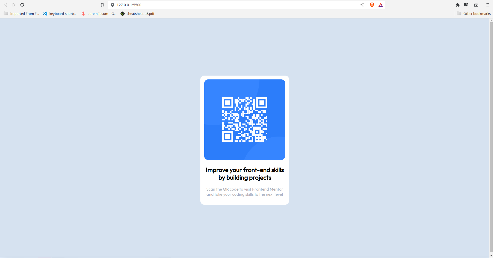

# Frontend Mentor - QR code component solution

This is a solution to the [QR code component challenge on Frontend Mentor](https://www.frontendmentor.io/challenges/qr-code-component-iux_sIO_H). Frontend Mentor challenges help you improve your coding skills by building realistic projects.

## Table of contents

-[Overview](#overview)
    - [Screenshots](#screenshots)
    - [Links](#links)
- [My process](#my-process)
    - [Built with](#built-with)
- [Author](#author)
- [Acknowledgments](#acknowledgments)

## Overview

### Screenshots

### Links

- Live Site URL: [Live site here](https://yosef-s-a.github.io/Frontend_Mentor-QR_code_component/)

## My process

### Built with

- Semantic HTML5 markup
- CSS 

## Author

Twitter - [@YosefSamuel7](https://twitter.com/YosefSamuel7)